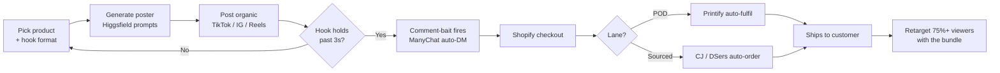

# Gag-Gift Brand Playbook

Pivot from *Horizontal Club* (quiet-luxury sleepwear) to **novelty / gag gifts**. Honestly a
stronger commercial bet: impulse-priced, gift-driven, absurdly shareable, and with real
seasonal spikes you can plan around.

> **Poster system:** [`../marketing/poster-system.html`](../marketing/poster-system.html)
> — 6 poster formats, house rules, and the image/video prompts.

---

## 1. Why this category works

- **The share is the ad.** The reference posts hit **121K**, **35.9K**, and **625** shares
  organically. Nobody shares a discount — they share *a person they know*. Reach is free.
- **Gifting doubles the market.** The buyer is rarely the wearer. That kills price
  sensitivity: nobody comparison-shops a joke.
- **Seasonality is a feature.** Halloween, Christmas, Father's Day, Secret Santa,
  bachelor/ette parties, tailgates. Plan drops around them.
- **Impulse price band.** $25–45 converts on a laugh with no research phase.

---

## 2. ⚠️ Two fulfilment lanes (this changes everything)

Most of the reference products **are not print-on-demand**. Printful/Printify cannot make an
inflatable shark suit. You need two lanes:

| Lane | Products | Supplier | Automation |
|---|---|---|---|
| **A · POD** (print on blanks) | Funny tees, hoodies, mugs, **doormats**, posters, socks | **Printify / Printful** | Shopify app → auto-fulfil. Zero inventory. |
| **B · Sourced novelty** | Inflatable costumes, hairy-leg shorts, window silhouettes, gag gadgets | **CJ Dropshipping / AliExpress / Zendrop** | **DSers** or **CJ app** → auto-order on purchase |

**Lane B setup (the part you don't have yet):**
1. Install **CJ Dropshipping** or **DSers** from the Shopify App Store.
2. Find the product → import to your store → **map the variant** to the supplier SKU.
3. Turn on **auto-order** (charges your balance and places the supplier order automatically).
4. **Order a sample first.** Non-negotiable for Lane B — novelty goods have real quality
   variance, and a bad shark suit becomes a refund plus a nasty comment section.
5. Set **shipping expectations** on the product page. Lane B ships slower than POD; say so.

**Start:** 2 Lane-A products (fast, safe, high margin) + 1 Lane-B hero (the viral one).

---

## 3. Product shortlist

Grounded in the references, extended into a coherent line. Nothing here copies another
seller's artwork or brand — the *categories* are generic; the jokes must be yours.

| # | Product | Lane | Price | Peak season | Hook format |
|---|---|---|---|---|---|
| 1 | Inflatable animal suit (shark / dino / T-rex) | B | $39–55 | Halloween, lake season | The Dare |
| 2 | Novelty "hairy leg" shorts / leggings | B | $29–39 | Summer, cookouts | The Call-Out |
| 3 | Window silhouette decals (creepy hands, figures) | A/B | $19–29 | **Halloween** | The Alibi |
| 4 | Funny statement tee / long-sleeve | A | $32–42 | Year-round | The Gatekeep |
| 5 | Absurd doormat (situational joke) | A | $28–38 | Housewarming, Christmas | The Alibi |
| 6 | "World's Okayest ___" mug / trophy | A | $22–28 | Office gifting, Father's Day | The Deadpan Spec |
| 7 | Gag apron ("licensed to grill") | A | $29–36 | Father's Day, BBQ | The Call-Out |
| 8 | Prank gift box (real product, ridiculous box) | B | $12–18 add-on | Christmas | Upsell at checkout |

**Bundle:** *The Uncle Starter Pack* — shorts + apron + mug. Gag gifts bundle beautifully
because the buyer is already shopping for "a laugh," not a specific item.

---

## 4. The viral mechanics (decoded from real posts)

| Mechanic | The line | Why it works | Result |
|---|---|---|---|
| **Share-bait** | "Send this to an uncle that needs this 😂" | Casts a real person | 625 shares |
| **Duo-bait** | "If you buy one, I'll buy one 🤞" | Can't be answered alone → sells 2 | 35.9K shares |
| **Comment-bait** | "Comment [WORD] and I'll send the link" | Comments drive reach; feeds auto-DM | 121K shares, 10K comments |
| **Scold POV** | "Babe, stop scaring the neighbours, you're 35" | Sells not-caring as identity | High saves |

**Automate the comment-bait:** **ManyChat** (or Instagram/TikTok auto-DM) — trigger on the
keyword, auto-reply with the product link. This is the single highest-leverage automation in
the whole build: it turns a comment section into a sales funnel while you sleep.

---

## 5. Content → order flow



---

## 6. Keep it sellable

Two practical constraints — both about money, not taste:

- **Profanity/sexual copy kills paid reach.** Meta and TikTok reject it, and TikTok Shop
  pulls the listings. The reference vape shirt works *organically* and can't be advertised.
  **Fix:** every winner gets an **edgy organic cut** and a **clean paid cut**.
- **Aim jokes at situations, not identities.** Cookouts, in-laws, neighbours, the group chat
  — those travel and stay ad-safe. Jokes that rank or target people by who they *are* get
  demonetised, pulled, and screenshot-dragged, which is an expensive way to learn the
  lesson. (This is why I skipped the skin-tone doormat from the references — it's the one
  product in the set that can't be run safely.)
- **Don't copy another seller's artwork, slogan, or brand name.** Categories are free; the
  specific joke and design must be yours.

---

## 7. Setup checklist

```
Lane A  [ ] Printify installed + synced   [ ] 2 POD designs uploaded
Lane B  [ ] CJ/DSers installed  [ ] Variants mapped  [ ] Auto-order ON
        [ ] SAMPLE ORDERED AND APPROVED   [ ] Ship times on product page
Money   [ ] Shopify Payments + PayPal live   [ ] Card on file w/ supplier
Reach   [ ] ManyChat keyword auto-DM   [ ] TikTok + Meta pixels
Posters [ ] 6 formats generated   [ ] Clean cut + edgy cut of each winner
Test    [ ] Test order placed and routed correctly
```
