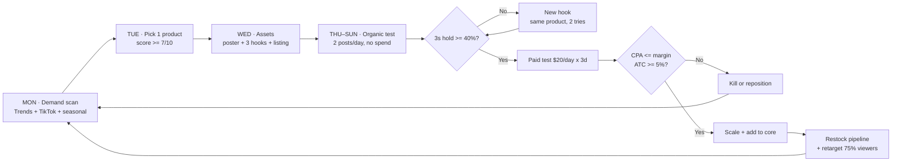

# The Growth Loop — Deadpan Goods

A closed, data-driven cycle: **research → launch → test → scale or kill → restock the pipeline.**
Runs weekly. Every decision has a number attached, so nothing survives on vibes.



---

## 1 · The weekly cadence

| Day | Do | Output |
|---|---|---|
| **Mon** | Demand scan: Google Trends (5yr + 90d), TikTok Creative Center, seasonal calendar | 3 candidates |
| **Tue** | Score them (below). Pick **one**. IP-clear it. | 1 product |
| **Wed** | Generate poster + 3 hooks + listing. Create in Shopify as DRAFT. | Assets |
| **Thu–Sun** | Post 2×/day organic. Zero ad spend. | Hook data |
| **Sun PM** | Review numbers. Scale, re-hook, or kill. | Decision |

**One product per week. Not three.** A single product with 12 creatives beats three products with four.

## 2 · Product scorecard (gate: ≥ 7/10 to build)

| # | Test | Point |
|---|---|---|
| 1 | Generic search term rising over 3 yrs (not one brand's term) | 1 |
| 2 | Visible on TikTok in the last 30 days | 1 |
| 3 | Demonstrable in **under 3 seconds**, sound off | 1 |
| 4 | Names a *person* ("uncles who grill"), not a niche | 1 |
| 5 | Landed cost ≤ 30% of retail | 1 |
| 6 | Ships under 1kg, no battery/liquid/fragile | 1 |
| 7 | **Zero IP risk** — no character, brand, team, or likeness | 1 |
| 8 | Has a season or a gifting occasion | 1 |
| 9 | Supplier has ≥ 4.7 rating and ≥ 500 orders | 1 |
| 10 | You'd send it to someone yourself | 1 |

**< 7 → reject.** #7 is a hard veto regardless of total.

## 3 · The numbers that decide things

| Metric | Where | Gate | If missed |
|---|---|---|---|
| 3-second hold | TikTok analytics | **≥ 40%** | New hook (max 2 tries), then kill |
| Share rate | TikTok | **≥ 1%** | Hook isn't "send this to ___" enough |
| Cold add-to-cart | Shopify sessions | **≥ 5%** | Fix offer/price, not the ad |
| Conversion rate | Shopify | **≥ 1.5%** | Product page or trust problem |
| CPA | Ads manager | **≤ contribution margin** | Kill |
| Refund rate | Shopify | **< 8%** | Supplier problem — switch |
| AOV | Shopify | **≥ $55** | Push the bundle harder |

**Contribution margin** = retail − landed cost − payment fees − expected refunds. If CPA
exceeds it, every sale loses money. That's the kill line, and it isn't negotiable.

**Weekly ShopifyQL to run** (via the connector, or Analytics → Reports):
```
FROM sessions SHOW sessions, sessions_with_cart_additions, conversion_rate TIMESERIES day SINCE -7d UNTIL today
FROM sales SHOW gross_sales, orders, average_order_value GROUP BY product_title ORDER BY gross_sales DESC LIMIT 10
FROM sales SHOW orders, total_sales GROUP BY order_referrer_source SINCE -30d UNTIL today
```

## 4 · Stock rules (dropshipping)

- **Inventory tracking OFF** on every variant. You hold no stock; tracking only creates false
  out-of-stocks that kill live ads. *(All 7 current products are already set this way.)*
- **Never let a supplier stockout become a customer problem.** Check supplier stock every
  Monday; if a hero product's supplier drops below ~200 units, line up a backup **before** you
  need it.
- **Two suppliers per hero product.** One goes dark eventually — they always do.
- **Cap the ad spend on any product whose supplier you haven't sample-tested.** No exceptions.

## 5 · Shipping rules

- **Free over $60** (pushes toward the $89 bundle) · **$5.95 flat** below it.
- **Publish real delivery windows.** Overpromising is the #1 chargeback source in novelty
  dropshipping. Under-promise, then arrive early.
- **Seasonal cutoffs on every product page** from Nov 1 (Christmas) and Oct 10 (Halloween).
  A gift that misses the occasion is a guaranteed refund.
- Ship zones must match your **market** (US), not your business address.

## 6 · Targeting: hook × audience × label

Match the format to the person. This is the precision layer.

| Audience label | Who | Hook format | Trigger line | Season |
|---|---|---|---|---|
| `uncle-cookout` | 35–60 M, grilling, lake, trucks | The Call-Out | "Uncles with adult money, you NEED this" | May–Aug |
| `group-chat` | 18–30, meme-forward | The Dare | "If you buy one, I'll buy one" | Year-round |
| `spooky-neighbour` | 28–45, homeowners, decor | The Alibi | "Babe, you're 35, stop scaring them" | **Aug–Oct** |
| `office-secret-santa` | 25–50, corporate | Deadpan Spec | "World's Okayest [role]" | Nov–Dec |
| `partner-gifter` | 25–45, buying for a spouse | The Alibi | "He will wear this every weekend. You did this." | Year-round |
| `bachelor-party` | 21–35, groups | The Dare | "the whole group or nobody" | Apr–Sep |

**Shopify tagging taxonomy** — tag every product with all three so reporting stays clean:
`audience:uncle-cookout` · `season:halloween` · `hook:the-dare`

**Retargeting ladder:** viewed 75%+ → proof/UGC · add-to-cart no buy → the bundle ·
past buyer → the next seasonal drop. **Never a discount** — it teaches people to wait.

## 7 · Seasonal calendar (build 6–8 weeks ahead)

| Launch by | Season | Products |
|---|---|---|
| **NOW — Aug** | 🎃 **Halloween** | Window silhouettes, inflatable suits, yard displays |
| Oct 1 | Christmas / Secret Santa | Trophy, mugs, prank boxes, bundles |
| Feb 1 | Father's Day | Apron, shorts, grill gear |
| Apr 1 | Summer / lake | Inflatables, pool gag gear |

**Halloween is the live one.** Search climbs from late summer through October, buyers shop
earlier every year, and 2026's trend is *outdoor, lit, social-shareable displays that make a
house a neighbourhood attraction* — which is exactly what the window silhouettes are.

> ⚠️ **IP veto in force.** 2026's top costume searches are K-Pop Demon Hunters and Wicked —
> both licensed. Never make those. Ride the **category** (outdoor spooky displays), never the
> character.

## 8 · Product lifecycle

```
DRAFT → sample ordered → QA passed → ACTIVE → organic test → paid test
      → SCALE (top 3)  |  MAINTAIN (pays for itself)  |  RETIRE (archive)
```

Review every product monthly. Archive anything that hasn't sold in 60 days — a bloated
catalog dilutes the brand and buries the winners.

## 9 · The weekly report (what to actually look at)

1. Sessions, ATC%, CVR — 7-day, versus prior week
2. Revenue by product — who's carrying the store
3. Traffic by source — where buyers actually come from
4. Best 3-second hold of the week — do more of that
5. Refunds + supplier issues
6. Next week's candidate + its score

**One rule above all: kill fast, scale slow.** Most products fail. The loop's job isn't to
avoid failure — it's to make failure cheap and winners obvious.
