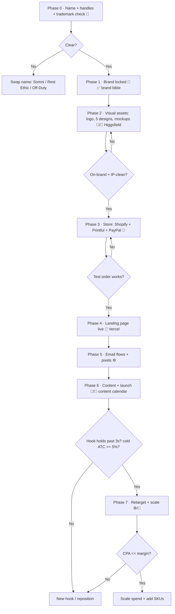

# Operating Flow — Horizontal Club (START HERE)

The single source of truth. Follow the phases top to bottom. Each step says **who** does it
(🧑 You / 🤖 AI / ⚙️ Automated), the **tool**, the **gate** you must pass before moving on,
and the **file** that has the details.



---

## Phase 0 — Lock the name 🧑 *(15 min, do first)*
- Check the `.com`, the @handle on IG + TikTok, and a USPTO Class 25 (apparel) search for
  **Horizontal Club**. Clear → keep it. Taken → swap to **Somni / Rest Ethic / Off-Duty**
  (the whole system still works).
- **Gate:** name is available on domain + both handles, no obvious trademark clash.

## Phase 1 — Brand ✅ *(done)*
- Positioning, palette, voice, products, pricing all locked.
- **File:** `playbooks/sleepmaxxing-brand-horizontal-club.md`

## Phase 2 — Visual assets 🤖/🧑 *(Higgsfield or any image tool)*
- Generate: logo → 5 hero designs (tonal type) → flat-lay + lifestyle mockups.
- Prompts are pre-written (§7 of the brand bible). *(I can run these once Higgsfield has
  credits; or you paste them into the Higgsfield web app.)*
- **Gate:** every asset is on-palette **and** passes IP clearance (no other brand/team/player).

## Phase 3 — Store 🧑 *(~30 min, only you — needs your logins)*
- Shopify → install **Printful** app → build the 7 products → **Sync**.
- Activate **PayPal** (Business) + card payments in Shopify Payments. Keep a card on file in
  Printful for production.
- **Gate:** place a **test order** and confirm it routes to Printful.
- **Files:** `workflow/automation-blueprint.md`, `store/product-listings.md`

## Phase 4 — Landing page 🧑 *(~10 min, Vercel free)*
- Deploy `store/landing-page.html`; replace `REPLACE_STORE_URL` + the form endpoint.
- **Gate:** page loads, buttons go to Shopify, email form captures.

## Phase 5 — Marketing engine ⚙️ *(set once, runs forever)*
- Paste the 3 email flows into Shopify Email / Klaviyo.
- Install **TikTok Pixel** + **Meta Pixel** via Shopify.
- **Gate:** a test signup triggers the welcome email; pixels show "active."

## Phase 6 — Content + launch 🤖/🧑
- Post from the 14-day calendar (1–2/day). Organic first.
- **Gate:** a hook that **holds past 3s** and drives **cold add-to-cart ≥ 5%**.
- **File:** `marketing/content-calendar.md`

## Phase 7 — Retarget + scale ⚙️/🧑
- Build audiences: viewed 75%+ of a video, add-to-cart-no-buy. Retarget with proof + the
  Member's Kit (never a discount).
- **Kill rule:** after 2 creative rounds, if CPA stays above contribution margin →
  reposition or kill. Winner → scale spend + add SKUs.

---

## ✅ Launch checklist
```
Phase 0  [ ] Name free on .com + @IG + @TikTok   [ ] Class 25 TM search clean
Phase 2  [ ] Logo   [ ] 5 designs   [ ] Mockups   [ ] IP cleared
Phase 3  [ ] Shopify live   [ ] Printful synced   [ ] PayPal + cards on
         [ ] Card on file in Printful   [ ] Test order routed
Phase 4  [ ] Landing page deployed   [ ] Links + form working
Phase 5  [ ] 3 email flows on   [ ] TikTok pixel   [ ] Meta pixel
Phase 6  [ ] 5 posts scheduled   [ ] First hook tested
Phase 7  [ ] Retarget audiences built   [ ] Kill rule written on the wall
```

## Who does what
| 🧑 You (only you can) | 🤖 AI / me | ⚙️ Automated after setup |
|---|---|---|
| Account logins, PayPal, card on file | Research, copy, listings, calendar, page | Order → print → ship |
| IP clearance + taste calls | Design/video prompts (+ generation w/ credits) | Payments |
| Sample QA, in-voice replies | Iterating hooks, reports | Email flows, retargeting |

## File map
- Brand → `playbooks/sleepmaxxing-brand-horizontal-club.md`
- Connect + automate → `workflow/automation-blueprint.md`
- Products + emails → `store/product-listings.md`
- Landing page → `store/landing-page.html`
- Content → `marketing/content-calendar.md`
- Trends / IP background → `playbooks/trending-products-2026.md`
